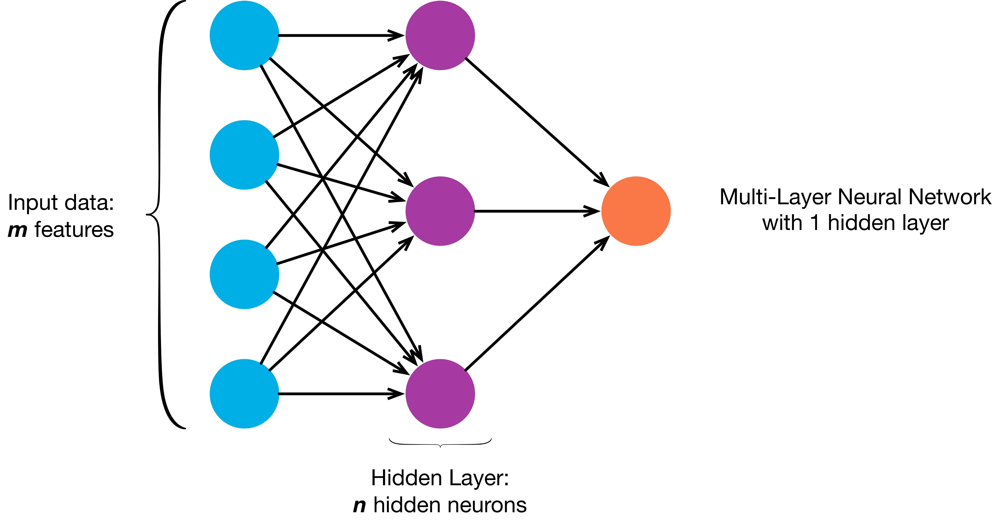
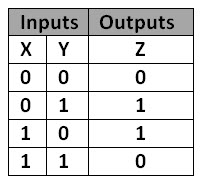
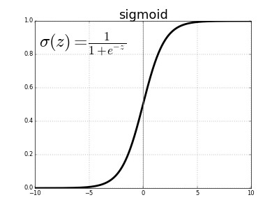
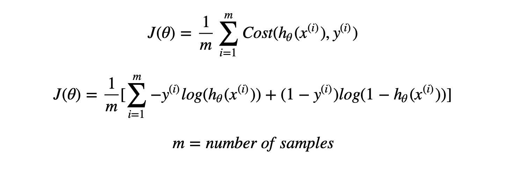
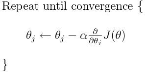

# NeuralNetwork-from-scratch
This is a project in which I am demonstrating a one hidden layered neural network from scratch by using numpy and matplotlib. 
 
  As shown in the image there are 'm' nodes in the input_layer, 'n' nodes in the hidden_layer and one node in output_layer.
 The purpose of a neural network is to provide a non linear function to the complex data to fit, so the most primary example we can use is Logic Gates (It is the Hello World for neural nets).
 So for example I am taking XOR Gate as training data. You can feed your own data to this network.
 
   Now for this example we have 2 inputs so we will set input_nodes = 2, hidden_nodes = 3(can be any number for you), output_nodes = 1(because the output value can be either 0 or 1)
  So what actually happens here??
 First the training data(here the data and y) is fed to the input layer of network. Each node in the layer or the network has a math function, that predicts a hypotheses by given formula.

## Y = WTX + b
Here *W* is the weight and *b* is the bias.

Then Y is given to an activation function here we are using "sigmoid function" 
 
 The output of sigmoid function is represented as 'a', and as this is the first activated value we will represent it by a[1]
  Sigmoid Function will give the output ranging between [0, 1].
  By doing this to input_layer, these same steps are being repeated in the hidden layer but here the "X" is the a[1].
 And the output_layer will give some output ranging between [0, 1], so now we have to check whether the answer is right or wrong and if wrong how much we are wrong to predict.
 To find the error in our prediction and actual output is called as *Cost Function*.
 And *Cost Function* is represented by **J**.
 

 Everything that happened till now is called as ***Forward Propagation*** that is because our flow was from input to output. But now we have the Cost and we have to improve our prediction so we have to tune our Weights and Biases by going towards Input Layer and tuning all the parameters.
## Back Propagation:
As we have currently worked on the output_layer, we will persuit to the hidden_layer (we have only one hidden layer) and perform *Gradient Descent*.
 
  Our goal is to reduce the Cost, in other words we want to reach the smallest possible value of cost function (Global Minima of it).
 To achieve this we have to gradually change the parameters so we need a *Learning Rate* "alpha" that decides the rate of change of the Gradient Descent. If the alpha is too small it will take so much time to reach the global minima and if alpha is too big then we may miss the global minima and get higher and higher Cost, this is called "Exploding Gradient Problem", to prevent it we must have a precise value of alpha.
 The equation for Gradient Descent is as below:
  

 After we get Convergance we can stop the iterations and then the model is usable for test data.

## Conclusion:
We have made a complete one-hidden layered Neural Network using numpy and matplotlib and understood the concepts of Basics of Neural Networks.
