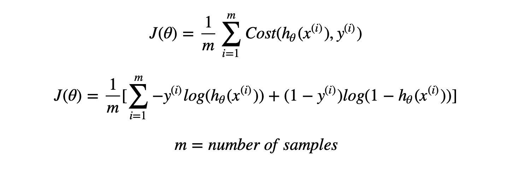

# NuralNet-from-scratch
This is a project in which I create one hidden layered nural network from scratch using numpy and matplotlib. 
 
  As shown in the image there are 'm' nodes in input, 'n' nodes in the hidden layer and an output node.
 The reason to use a neural network is when the data needs a non linear function to fit, so the most primary example we can use is Logic Gates (It is the Hello World for neural nets).
 So for example I am taking XOR Gate as training data. You can feed your own data to this network.
 
   Now for this example we have 2 inputs so we will set input_nodes = 2, hidden_nodes = 3(can be any number for you), output_nodes = 1(because the output value can be either 0 or 1)
  So what actually happens here??
 First the training data(here the data and y) is fed to the input layer of network. Each node in the layer or the network has a math function, that predicts a hypotheses by given formula.

## Y = WTX + b
Here *W* is the weight and *b* is the bias.

Then Y is given to an activation function here we are using "sigmoid function" 
 
 The output of sigmoid function is represented as 'a', and as this is the first activated value we will represent it by a[1]
  Sigmoid Function will give the output ranging between [0, 1].
  By doing this to input_layer, these same steps are being repeated in the hidden layer but here the "X" is the a[1].
 And the output_layer will give some output ranging between [0, 1], so now we have to check whether the answer is right or wrong and if wrong how much we are wrong to predict.
 To find the error in our prediction and actual output is called as *Loss Function*.
 And *Loss Function* is represented by **J**.
 

 Everything that happened till now is called as ***Forward Propagation*** that is because our flow was from input to output. But now we have the loss and we have to improve our prediction so we have to tune our Weights and Biases by going towards Input Layer and tuning all the parameters.
## Back Propagation:
As we have currently worked on the output_layer, we will persuit to the hidden_layer (we have only one hidden layer) and perform *Gradient Descent*.
 
